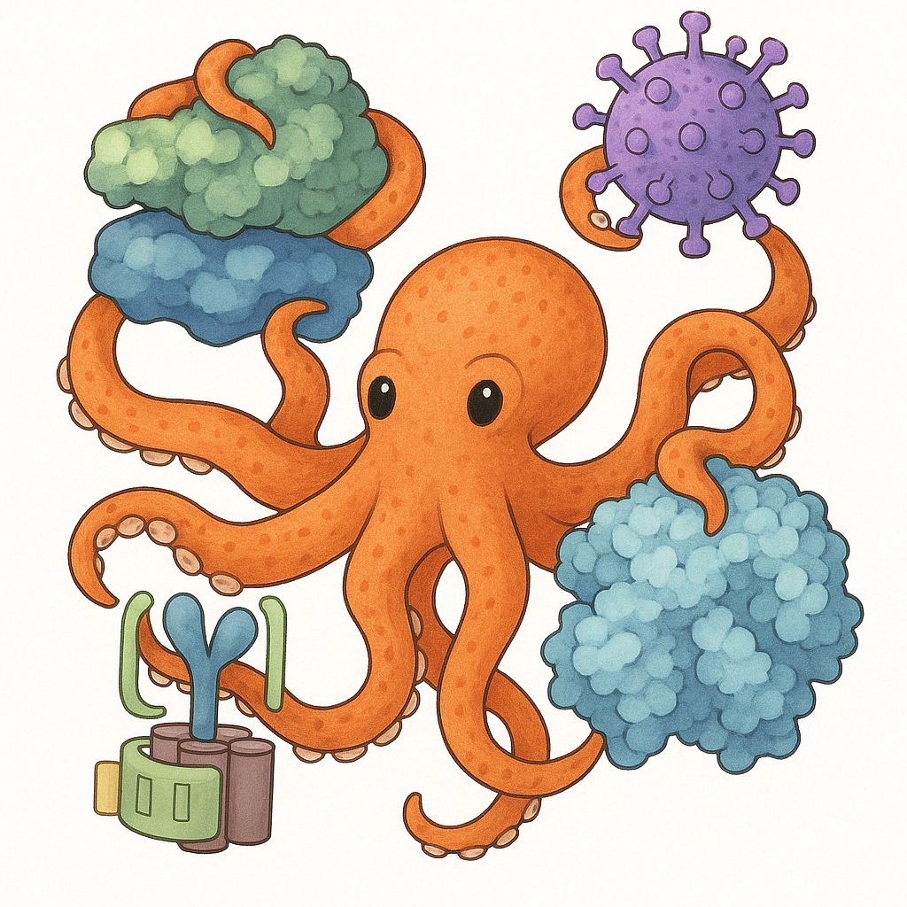

# OCTOPI 🐙🐙🐙

**O**bject dete**CT**ion **O**f **P**rote**I**ns. A deep learning framework for Cryo-ET 3D particle picking with autonomous model exploration capabilities.

## Introduction

octopi addresses a critical bottleneck in cryo-electron tomography (cryo-ET) research: the efficient identification and extraction of proteins within complex cellular environments. As advances in cryo-ET enable the collection of thousands of tomograms, the need for automated, accurate particle picking has become increasingly urgent.

Our deep learning-based pipeline streamlines the training and execution of 3D autoencoder models specifically designed for cryo-ET particle picking. Built on [copick](https://github.com/copick/copick), a storage-agnostic API, octopi seamlessly accesses tomograms and segmentations across local and remote environments.

## Key Features

- Training and evaluating custom 3D U-Net models for particle segmentation
- Automatic model architecture exploration using Bayesian optimization via Optuna
- Inference for both semantic segmentation and particle localization
- Seamless integration with MLflow for experiment tracking
- Support for both CLI and Python API interfaces
- HPC cluster compatibility with SLURM integration

## Quick Links

- [Installation Guide](getting-started/installation.md)
- [CLI Tutorial](user-guide/cli-tutorial.md)
- [API Tutorial](user-guide/api-tutorial.md)
- [Model Exploration](user-guide/model-exploration.md)

## Getting Help

- Check out our [documentation](user-guide/cli-tutorial.md) for detailed guides
- Explore our [API reference](api/core.md) for Python usage
- Visit our [GitHub repository](https://github.com/chanzuckerberg/octopi) for source code and issues 