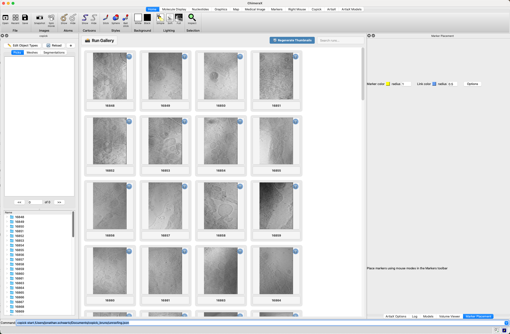
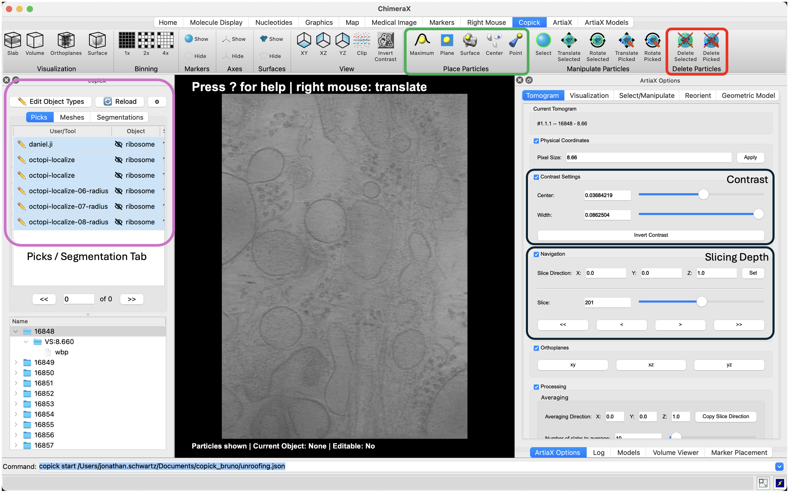
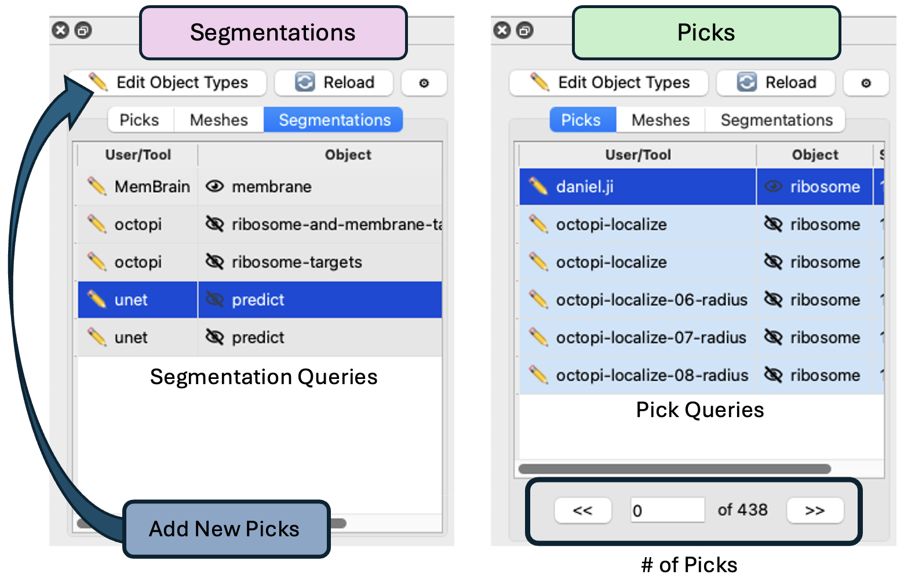
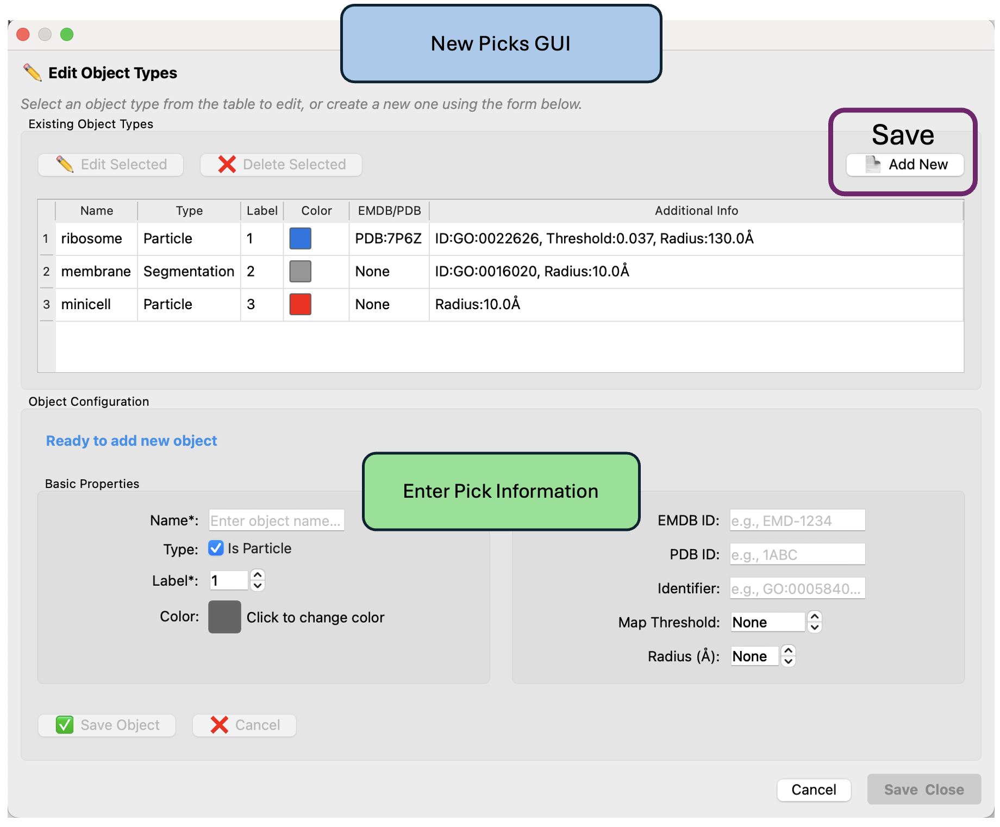

# ChimeraX-Copick Plugin Guide

**⚠️ Note:** We strongly recommend using a mouse for this workflow, as right-clicking is essential for placing and manipulating picks.


## Installation

### 1. Download ChimeraX
First, download and install ChimeraX from the [official website](https://www.cgl.ucsf.edu/chimerax/)

### 2. Install the Copick Plugin
Once ChimeraX is installed:

1. Open ChimeraX
2. Go to **Tools → More Tools...** to open the toolshed
3. Search for `copick` in the search bar
4. Download and install the copick plugin

## Setup for Remote Data Access

### SSH Tunnel Configuration
If your data is stored on a remote repository (not locally available), you'll need to establish an SSH tunnel:

```bash
ssh -L 2222:localhost:22 username@your-remote-server
```

This command creates a local port forwarding from port 2222 to the remote server's port 22, allowing secure access to remote data.

**Note:** If you're working with data that's already available on your local machine, you can skip this SSH tunnel step.

## Launching the Plugin

### Workflow Overview
1. **Select a tomogram**: Click on any thumbnail in the gallery to open the tomogram
2. **Navigate the data**: Use ChimeraX's navigation tools to explore the 3D volume
3. **Pick particles**: Select the appropriate object type and begin picking
4. **Save progress**: Your picks are automatically saved to the overlay directory

### Starting Copick
1. Open ChimeraX
2. In the command line, enter:
   ```
   copick start /path/to/your/config.json
   ```
3. The plugin will launch and display a gallery of available tomograms

Once launched, you'll see the Run Gallery with thumbnail previews of all available tomograms. Each thumbnail shows a 2D slice preview and is numbered for easy identification (16848, 16849, etc.). Click on any thumbnail to open that tomogram for picking.


*Run Gallery showing thumbnail previews of all available tomograms. Each thumbnail displays a central slice preview with the runID.*

When you select a tomogram, ChimeraX opens the full 3D visualization interface. The tomogram data is displayed in the center, while the Copick plugin panel remains on the left showing your picks, segmentations, and other data. Use ChimeraX's navigation tools to explore the 3D volume and click to place picks. 

Use the **Contrast** panel (right side) to adjust the center and width settings for optimal visualization of your particles. Proper contrast adjustment is crucial for accurate picking. The **Slicing Depth** panel allows you to navigate through different Z-planes of your tomogram. Use the slice controls to move through the volume and examine particles at different depths.


*ChimeraX picking interface showing the complete workflow setup: Copick Control Panel (left, highlighted in purple), tomogram visualization (center), particle manipulation toolbar (top, highlighted in red), and navigation panels including Contrast and Slicing Depth controls (right).*

## Plugin Panel Organization

The Copick plugin panel on the left side of ChimeraX is organized  main tabs: (1) Segmentations (2) Picks and (3) Meshes.


*Detailed view of the Copick Control Panel showing the Picks and Segmentations tabs with their respective data management interfaces.*

### Segmentations
Shows available segmentation data with different users/tools and their corresponding objects. You can see entries like "MemBrain" for membrane segmentation and "octopi" for ribosome-related segmentations. The **Edit Object Types** button (pencil icon) allows you to create new segmentation sets.

### Picks
Displays all existing pick sets, organized by User/Tool and Object type. Here you can see various automated picking results (octopi-localize) for ribosome objects, as well as manual picks (daniel.ji). The pick counter at the bottom shows the total number of picks available (438 in this example).

### Manipulating Picks

You have several options for working with picks:

**Editing Existing Picks:**

- Click any pick set from the Picks panel to select it
- Right-click in the 3D view to place new picks, then click **Place** in the top-right panel
- Right-click to select existing picks, then click **Delete Selected** to remove them

**Creating New Pick Sets:**

- Use the **Edit Object Types** button (pencil icon) to start fresh with a new user ID
- This is useful when annotating new particle species or starting a new picking session

## Creating New Pick Sets

**Use the Edit Object Types button (pencil icon) to start fresh with a new user ID or when annotating new particle species.**


*New Picks GUI showing existing object types (top table) and object configuration form (bottom) for creating new pickable objects.*

When you click the **Edit Object Types** button, the New Picks GUI opens with two main sections:

#### **Existing Object Types (Top Section)**

- View all currently configured pickable objects in your project
- Each row shows the object's Name, Type (Particle/Segmentation), Label number, Color, and additional metadata
- Use **Edit Selected** to modify existing objects or **Delete Selected** to remove them
- Click **Add New** (highlighted in purple) to create a new object type

#### **Object Configuration (Bottom Section)**
When creating a new pickable object, you'll need to specify:

**Basic Properties:**

- **Name**: Enter a descriptive name for your particle type
- **Type**: Check "Is Particle" for point-like objects (unchecked for segmentations)
- **Label**: Assign a unique numeric identifier
- **Color**: Click the color box to choose a visualization color

**Advanced Properties:**

- **EMDB ID**: Link to Electron Microscopy Data Bank entry (optional)
- **PDB ID**: Link to Protein Data Bank structure (optional)
- **Identifier**: Gene Ontology or other database identifier (optional)
- **Map Threshold**: For segmentation objects (optional)
- **Radius (Å)**: Physical size of the particle in Angstroms

Click **Save Object** to add the new pickable object to your project, or **Cancel** to discard changes.