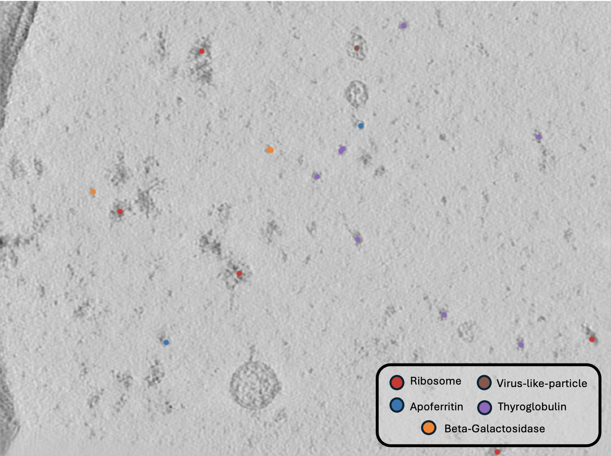

# Inference Guide

This guide covers how to apply your trained Octopi models to generate predictions and extract particle coordinates from new tomograms. Inference is a two-step process: segmentation followed by localization.

## Overview 

Octopi inference follows a systematic two-step approach:

1. **Segmentation** - Apply trained model to generate 3D probability masks with test-time augmentation (TTA).
2. **Localization** - Convert probability masks into 3D coordinates using size-based filtering.
3. **Evaluation (Optional)** - Compare predicted coordinates against ground truth annotations.

??? tip "Parallelism and Resource Utilization"

    Octopi parallelizes inference workloads at the **run level**, automatically adapting to the available compute resources.

    !!! info "Segmentation (`octopi segment`)"
        - Uses **GPU-based parallelism**
        - On a system with **N GPUs**, up to **N runs** are segmented concurrently
        - Each worker processes one tomogram at a time using a single GPU
        - Parallelism scales from a single workstation to multi-GPU HPC nodes

    !!! info "Localization (`octopi localize`)"
        - Uses **CPU-based parallelism**
        - Multiple tomograms are localized concurrently across available CPU cores
        - No GPUs are required for localization

    On shared HPC systems, the degree of parallelism is determined by the number of GPUs (for segmentation) or CPU cores (for localization) allocated to the job.

## Segmentation 

Generate segmentation prediction masks for tomograms using your trained model.

```bash
octopi segment \
    --config config.json \
    --model-config best_model_config.yaml \
    --model-weights best_model.pth \
    --voxel-size 10 --tomo-alg wbp \
    --seg-info predict,unet,1
```

??? info "`octopi segment -h`"

    === "Input"

        | Parameter | Description | Default | Notes |
        |----------|-------------|---------|------|
        | `--config` | Path to the CoPick configuration file. | – | Required |
        | `--voxel-size` | Voxel size (Å) of tomograms used for inference. | `10` | Must match training |
        | `--tomo-alg` | Tomogram reconstruction algorithm used for prediction. | `wbp` | Example: `denoised` |

    === "Model"

        | Parameter | Description | Notes |
        |----------|-------------|------|
        | `--model-config` | Model configuration file(s). | Required; comma-separated for ensembles |
        | `--model-weights` | Model weight file(s). | Must match `--model-config` order |

    === "Inference"

        | Parameter | Description | Default | Notes |
        |----------|-------------|---------|------|
        | `--seg-info` | Output segmentation identifier (`name,user_id,session_id`). | `predict,octopi,1` | Used to organize results |
        | `--tomo-batch-size` | Number of tomograms processed concurrently. | `1` | One per GPU worker |
        | `--run-ids` | Specific run IDs to segment. | All runs | Example: `run1,run2` |

### Model Ensembles

`octopi segment` supports **model ensembles** (commonly referred to as *model soups*) by providing multiple model configurations and weights as comma-separated lists.

```bash
octopi segment \
    --config config.json \
    --model-config model1.yaml,model2.yaml \
    --model-weights model1.pth,model2.pth \
    --seg-info ensemble,octopi,1
```

## Localization 

Convert segmentation masks into 3D particle coordinates using peak detection.

```bash
octopi localize \
    --config config.json \
    --seg-info predict,unet,1 \
    --pick-session-id 1 --pick-user-id octopi
```

The localization algorithm uses **particle size information** from your copick configuration to filter predictions. For each protein type, Octopi reads the expected particle radius from the copick config file. Predicted candidates smaller than `radius * radius_min_scale` or larger than `radius * radius_max_scale` are discarded as noise.

??? info "`octopi localize -h`"

    === "Input"

        | Parameter | Description | Default | Notes |
        |----------|-------------|---------|------|
        | `--config` | Path to the CoPick configuration file. | – | Required |
        | `--method` | Localization algorithm to use. | `watershed` | Options: `watershed`, `com` |
        | `--seg-info` | Segmentation input identifier (`name,user_id,session_id`). | `predict,octopi,1` | Must match segmentation output |
        | `--voxel-size` | Voxel size (Å) for localization. | `10` | Must match segmentation |
        | `--runIDs` | Specific run IDs to localize. | All runs | Example: `run1,run2` |

    === "Localization"

        | Parameter | Description | Default | Notes |
        |----------|-------------|---------|------|
        | `--radius-min-scale` | Minimum particle radius scale factor. | `0.5` | Relative to config radius |
        | `--radius-max-scale` | Maximum particle radius scale factor. | `1.0` | Relative to config radius |
        | `--filter-size` | Filter size for peak detection (watershed). | `10` | Ignored for `com` |
        | `--pick-objects` | Specific objects to localize. | All objects | Example: `ribosome,apoferritin` |
        | `--n-procs` | Number of CPU processes for parallelization. | `8` | Defaults to min(cores, runs) |

    === "Output"

        | Parameter | Description | Default | Notes |
        |----------|-------------|---------|------|
        | `--pick-session-id` | Session ID for particle picks. | `1` | Used for result grouping |
        | `--pick-user-id` | User ID for particle picks. | `octopi` | Used for result grouping |

## Evaluate Results

Evaluate the particle coordinates against the coordinates that were used to generate the segmentation masks. 

```bash
octopi evaluate 
    --config config.json
    --ground-truth-user-id data-portal --ground-truth-session-id 0
    --predict-user-id octopi --predict-session-id 1
    --save-path evaluate_results
```

??? abstract "Evaluation Metrics"

    - **Precision**: Fraction of predicted particles that are correct (TP / (TP + FP))
    - **Recall**: Fraction of true particles that were detected (TP / (TP + FN))  
    - **F1-Score**: Harmonic mean of precision and recall
    - **F-beta Score**: Weighted harmonic mean emphasizing recall (configurable β parameter)
    - **True Positives (TP)**: Correctly detected particles within distance threshold
    - **False Positives (FP)**: Predicted particles with no nearby ground truth
    - **False Negatives (FN)**: Ground truth particles with no nearby predictions

## Visualization

To visualize your results and validate the quality of segmentations and coordinates, refer to our interactive notebook:

**📓 [Inference Notebook](https://github.com/chanzuckerberg/octopi/blob/main/notebooks/inference.ipynb)**

With this notebook, we can overlay the segmentation masks or coordiantes the tomograms. 


*Example of predicted particle coordinates displayed on a holdout tomogram from cryo-ET training dataset. The visualization shows Octopi's localization results overlaid on tomographic data from [DatasetID: 10440](https://cryoetdataportal.czscience.com/datasets/10440).*

## Next Steps

You now have a complete workflow for applying Octopi models to new tomographic data. The inference pipeline transforms your trained models into actionable scientific results through robust segmentation, intelligent localization, and comprehensive evaluation.

For users who want to integrate Octopi into custom analysis pipelines or automate large-scale processing workflows, refer to the [API Tutorial](api-tutorial.md) to learn how to script new workflows programmatically with OCTOPI's Python interface.