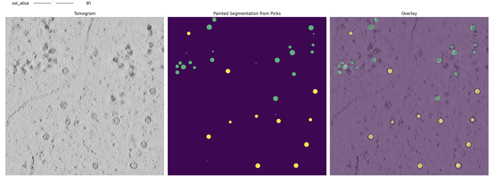

# Creating Training Targets

In this step, we will prepare the target data necessary for training our model and predicting the coordinates of proteins within a tomogram.

We will use Copick to manage the filesystem, extract runIDs, and create spherical targets corresponding to the locations of proteins. Key tasks include:

* **Generating Targets**: For each tomogram, we extract particle coordinates and generate spherical targets based on these coordinates, and save the target data in OME Zarr format.

* **Target dimensions** are determined with an associated tomogram, (specified by the `--tomo-uri` parameter, e.g. `wbp@10.0`).

* **Additional segmentations** like organelles and membranes can be included as continuous targets with the `--seg-target` flag. 

The segmentations are saved under the query specified by the `--target-uri` flag (`name:user_id/session_id`).  

## Method 1: Automated Query

The simplest approach is to let Octopi automatically find all pickable objects from a specific annotation source.

### When to Use
- ✅ **Single annotation source**: All picks come from one user/session
- ✅ **Quick setup**: Minimal parameter specification

#### Example Command

```bash
octopi create-targets \
    --config config.json \
    --picks-user-id data-portal --picks-session-id 0 \
    --seg-target membrane \
    --tomo-uri wbp@10.0 \
    --target-uri targets:octopi/1
```

This command automatically finds all pickable objects associated with `data-portal` user and session `0`, plus includes membrane segmentations.

## Method 2: Manual Specification

For more control, manually specify which protein types and annotation sources to include. Users can define a subset of pickable objects (from the CoPick configuration file) by specifying the name, and optionally the userID and sessionID. This allows for creating customizable training targets from varying submission sources. 

### When to Use
- ✅ **Multiple annotation sources**: Combining picks from different tools/users  
- ✅ **Selective training**: Only specific protein types needed
- ✅ **Quality control**: Excluding low-quality annotations

#### Advanced Command

```bash
octopi create-targets \
    --config config.json \
    --target apoferritin --target beta-galactosidase:slabpick/1 \
    --target ribosome:pytom/0 --target virus-like-particle:pytom/0 \
    --seg-target membrane \
    --tomo-uri wbp@10.0 \
    --target-uri targets:octopi/1
```

### Target Specification Formats

`--target` and `--seg-target` both accept the same query grammar:

| Format | Description | Example |
|--------|-------------|---------|
| `protein_name` | Use default user/session from config | `apoferritin` |
| `protein_name:user_id/session_id` | Specify source explicitly (preferred) | `ribosome:pytom/0` |
| `protein_name,user_id,session_id` | Legacy comma form (still supported) | `ribosome,pytom,0` |

## Check Target Quality

To validate your training targets, refer to our interactive notebook: [Inspect Segmentation Targets](https://github.com/Biohub/octopi/blob/main/notebooks/inspect_segmentation_targets.ipynb)

This notebook shows how to load segmentation targets and overlay targets on tomograms.


*Example of training targets overlaid on tomogram slices. Different colors represent different protein classes.*

## Command Reference: `octopi create-targets`

### Input Arguments

| Parameter | Description | Example | Required |
|-----------|-------------|---------|----------|
| `--config` | Path to CoPick configuration file | `config.json` | ✅ |
| `--target` | Pickable object target(s): "name" or "name:user_id/session_id" | `ribosome:pytom/0` | * |
| `--picks-session-id` | Session ID for automated pick retrieval | `0` | * |
| `--picks-user-id` | User ID for automated pick retrieval | `data-portal` | * |
| `--seg-target` | Continuous segmentation target(s): "name" or "name:user_id/session_id" | `membrane` | ❌ |
| `--run-ids` | Specific run IDs to process | `run_001,run_002` | ❌ |

*Either `--target` OR both `--picks-session-id` and `--picks-user-id` must be specified.

### Processing Parameters

| Parameter | Description | Default | Example |
|-----------|-------------|---------|---------|
| `--tomo-uri` | Tomogram URI in the form `alg@voxel_size` | `wbp@10.0` | `denoised@10.0` |
| `--radius-scale` | Scale factor for object radius | `0.8` | `0.8` (80% of original radius) |

### Output Arguments

| Parameter | Description | Default | Example |
|-----------|-------------|---------|---------|
| `--target-uri` | Output query as `name`, `name:user_id`, or `name:user_id/session_id` | `targets:octopi/1` | `my_targets:my_experiment/1` |


 