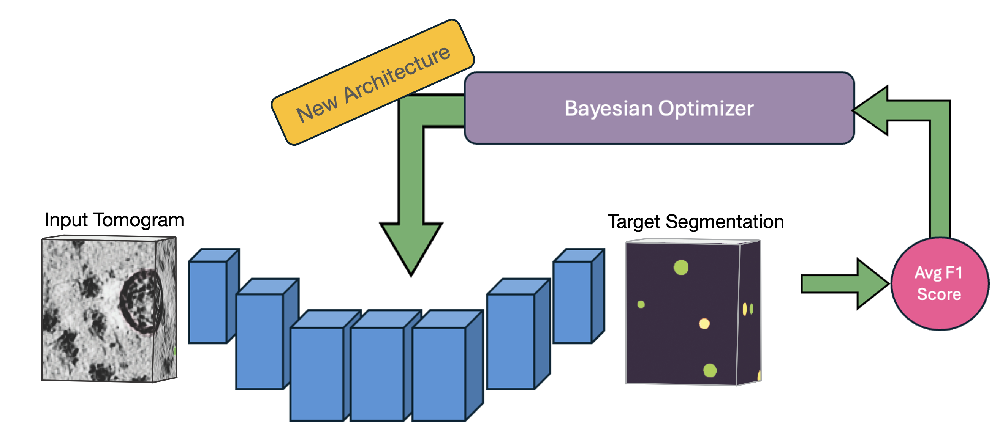
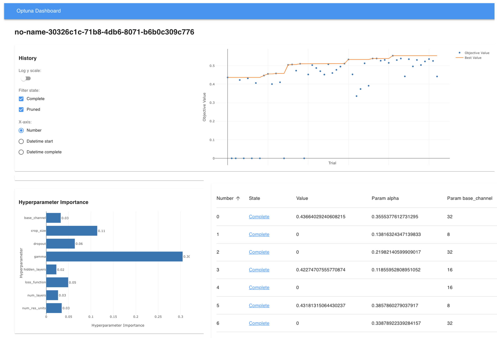

# Training Basics

This guide covers the recommended approach for training Octopi models using automated model exploration with Bayesian optimization. This is the best starting point for most users.

## Why Start with Model Exploration?

Rather than manually guessing which learning rates, batch sizes, or architectural choices work best for your specific tomograms, model exploration systematically tests combinations and learns from each trial to make better choices. This automated approach consistently finds better models than manual tuning.


*OCTOPI's automated architecture search uses Bayesian optimization to efficiently explore hyperparameters and find optimal configurations for your specific data.*

**Model exploration is recommended because:**

- ✅ **No expertise required** - Automatically finds the best model for your data
- ✅ **Efficient search** - Optimal performance tailored to your specific dataset
- ✅ **Time savings** - Avoids trial-and-error experimentation


## Quick Start

### Basic Model Exploration

```bash
octopi model-explore \
    --config config.json \
    --target-info targets,octopi,1 \
    --voxel-size 10 --tomo-alg denoised --Nclass 8 \
    --data-split 0.7 --model-type Unet \
    --num-trials 100 --best-metric fBeta3
```

This automatically saves results to a timestamped directory and runs 10 optimization trials by default.

## Key Parameters

| Parameter | Description | Default | Notes |
|-----------|-------------|---------|-------|
| `--config` | Path to copick config file(s) | - | Use multiple configs to combine datasets |
| `--voxel-size` | Voxel size for training | `10` | Must match your target segmentations |
| `--tomo-alg` | Tomogram algorithm | `wbp` | `wbp`, `denoised` - must match your data |
| `--Nclass` | Number of classes | `3` | Proteins + membrane + background |
| `--target-info` | Target segmentation info | `targets,octopi,1` | From label preparation step |
| `--num-trials` | Number of optimization trials | `10` | More trials = better optimization (try 25-50) |
| `--data-split` | Train/validation split | `0.8` | `0.7,0.2` = 70% train, 20% val, 10% test |
| `--best-metric` | Optimization metric | `avg_f1` | `fBeta3` = F-beta score with β=3 (emphasizes recall over precision) |

## What Gets Optimized

Model exploration uses **fixed architectures** with two available options:

- **Unet** - Standard 3D U-Net (default, recommended for most cases)
- **AttentionUnet** - U-Net with attention mechanisms (for complex data)

For each architecture, it optimizes:

- **Hyperparameters** - Learning rate, batch size, loss function parameters
- **Architecture details** - Channel sizes, stride configurations, residual units
- **Training strategies** - Regularization and data augmentation

## Understanding Classes

The `--Nclass` parameter is critical:

- **Background** (1 class) - Areas without particles
- **Proteins** (N classes) - Each protein type gets its own class
- **Segmentations** (M classes) - Additional targets like membranes

**Example:** 6 proteins + 1 membrane + 1 background = **8 classes**

## Monitoring Your Training

Monitor optimization progress in real-time:

### Optuna Dashboard

**Setup Options:**

- **VS Code Extension** - Install Optuna extension for integrated monitoring
- **Web Dashboard** - Follow [Optuna dashboard guide](https://optuna-dashboard.readthedocs.io/en/latest/getting-started.html)

**What you'll see:**



- Trial progress and current best performance
- Parameter importance (which settings matter most)
- Optimization history and convergence trends

### MLflow Tracking

#### Local MLflow Dashboard

To inspect results locally: `mlflow ui` and open http://localhost:5000 in your browser.

#### 🖥️ HPC Cluster MLflow Access (Remote via SSH tunnel)

If running octopi on a remote cluster (e.g., Biohub Bruno), forward the MLflow port. 

```bash
# On your local machine
ssh -L 5000:localhost:5000 username@remote_host

# On the remote terminal (login node)
mlflow ui --host 0.0.0.0 --port 5000
```

In the case of Bruno the remote would be `login01.czbiohub.org`

## Best Practices

1. **Start with default parameters** - Let optimization do the work
2. **Use multiple data sources** - Combine real and synthetic data when available
3. **Run sufficient trials** - At least 20-25 for good optimization
4. **Monitor progress** - Use Optuna dashboard to track convergence
5. **Validate results** - Check that best model makes sense for your data

## Next Steps

After model exploration completes:

1. **Review results** - Check optimization history and best trial performance
2. **[Run inference](inference.md)** - Apply your best model to new tomograms and get particle locations from predictions.