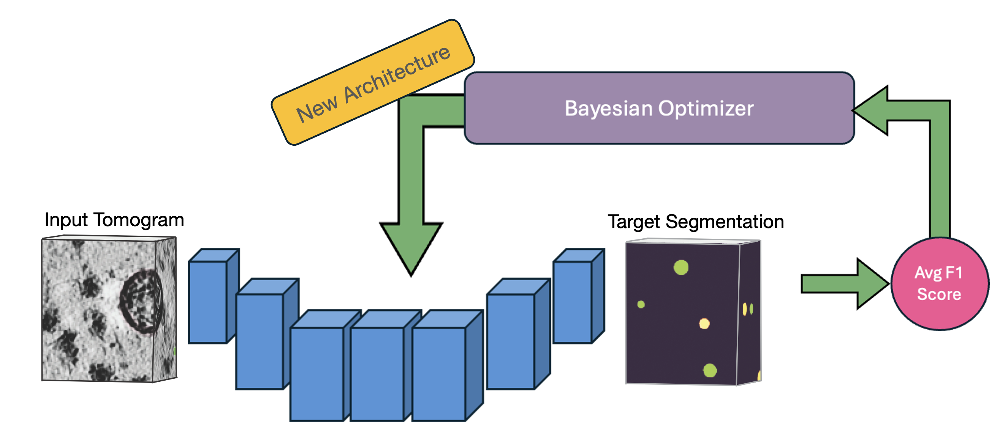
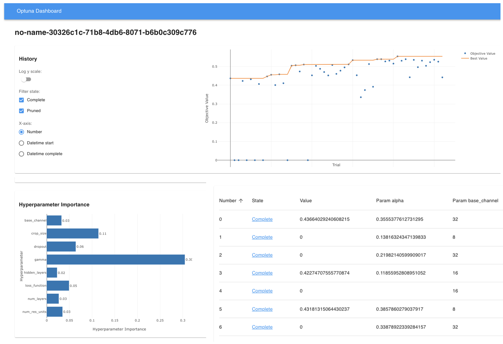
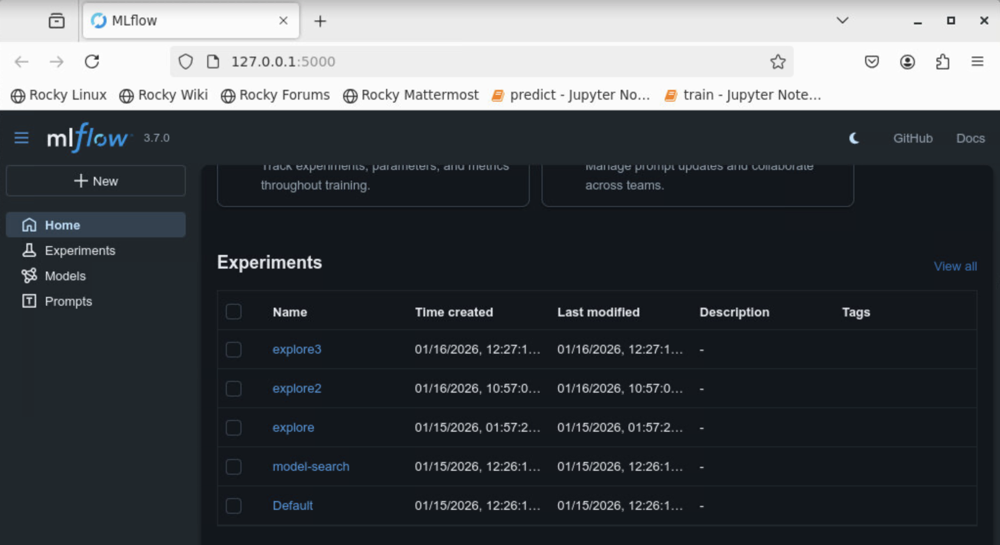

# Training Octopi Models

This guide explains how to train 3D U-Net–based models with Octopi, covering both single-model training and automated model exploration.

---

## Training Modes

Octopi supports two complementary workflows:

* **Single Model Training** – Train or fine-tune a specific architecture when you already know what you want.

* **Model Exploration** – Automatically search for strong architectures and hyperparameters using Bayesian optimization (recommended for new applications).

??? note "Dataset Splitting"

    For both **single-model training** and **model exploration**, Octopi supports training on data drawn from **multiple CoPick projects** by providing multiple `--config` files.

    You may explicitly control which runs are used for training and validation by specifying `--trainRunIDs` and `--validateRunIDs`.

    If neither of these options is provided, Octopi automatically:
    
    1. Collects all runs that contain both the requested tomograms and the specified segmentation targets
    2. Splits the data into training and validation sets according to the `--data-split` ratio

=== "Training Individual Models"

    ## Single Model Training

    For specific use cases or when you have a known good architecture, you can train a single model directly. In this case, the command only allows for training U-Net models. To play around with more unique model configurations, or to try importing new model designs refer to the API or `octopi model-explore`. 

    ### Training New Models

    This command initializes a new U-Net model using the specified architecture and training parameters.

    ```bash
    octopi train \
        --config config.json \
        --voxel-size 10 --tomo-alg wbp \
        --tomo-batch-size 50 --val-interval 10 \
        --target-info targets,octopi,1
    ```

    ### Fine Tuning Models

    If we have base weights that we would like to fine-tune for new datasets, we can still use the `train` command. Instead of specifying the model architecture, we can simply point to the configuration file and weights to load the existing model to fine tune.

    ```bash
    octopi train \
        --config config.json \
        --voxel-size 10 --tomo-alg wbp \
        --model-config results/model_config.yaml \
        --model-weights results/best_model_weights.pth
    ```

    ??? info "`octopi train` parameters"

        === "Input / Output"

            | Parameter | Description | Example |
            |----------|-------------|---------|
            | `--config` | One or more CoPick configuration files. Multiple entries may be provided as `session_name,path`. | `config.json` |
            | `--voxel-size` | Voxel size (Å) of tomograms used for training. Must match the target segmentations. | `10` |
            | `--target-info` | Target specification in the form `name` or `name,user_id,session_id`. | `targets,octopi,1` |
            | `--tomo-alg` | Tomogram reconstruction algorithm(s). Multiple values may be comma-separated. | `wbp` or `denoised,wbp` |
            | `--trainRunIDs` | Explicit list of run IDs to use for training (overrides automatic splitting). | `run1,run2` |
            | `--validateRunIDs` | Explicit list of run IDs to use for validation. | `run3,run4` |
            | `--data-split` | Train/validation(/test) split. Single value → train/val, two values → train/val/test. | `0.8` or `0.7,0.1` |
            | `--output` | Directory where model checkpoints, logs, and configs are written. | `results` |

        === "Training"

            | Parameter | Description | Default |
            |----------|-------------|---------|
            | `--num-epochs` | Total number of training epochs. | `1000` |
            | `--val-interval` | Frequency (in epochs) for computing validation metrics. | `10` |
            | `--batch-size` | Number of cropped 3D patches processed per training step. | `16` |
            | `--lr` | Learning rate for the optimizer. | `0.001` |
            | `--best-metric` | Metric used to determine the best checkpoint. Supports `fBetaN`. | `avg_f1` |
            | `--ncache-tomos` | Number of tomograms cached per epoch (SmartCache window size). | `15` |
            | `--background-ratio` | Foreground/background crop sampling ratio. | `0.0` |
            | `--tversky-alpha` | Alpha parameter for the Tversky loss (foreground weighting). | `0.3` |

        === "UNet Architecture"

            | Parameter | Description | Default |
            |----------|-------------|---------|
            | `--channels` | Feature map sizes at each UNet level. | `32,64,96,96` |
            | `--strides` | Downsampling strides between UNet levels. | `2,2,1` |
            | `--res-units` | Number of residual units per UNet level. | `1` |
            | `--dim-in` | Input patch size in voxels (cube). | `96` |

        === "Fine-Tuning"

            These options are used to continue training from an existing model.

            | Parameter | Description | Example |
            |----------|-------------|---------|
            | `--model-config` | Model configuration generated by a previous training run. | `results/model_config.yaml` |
            | `--model-weights` | Pre-trained model weights used for initialization. | `results/best_model_weights.pth` |


    !!! success "Training Output"
        During training, you'll see:

        * **Progress indicators**: Real-time loss and accuracy metrics
        * **Validation results**: Periodic evaluation on validation set
        * **Model checkpoints**: Saved to `results/` directory by default
        * **Training logs**: Detailed logs for monitoring and debugging

=== "Model Exploration"

    ## Model Exploration

    ### Why Start with Model Exploration?

    Rather than manually guessing which learning rates, batch sizes, or architectural choices work best for your specific tomograms, model exploration systematically tests combinations and learns from each trial to make better choices. This automated approach consistently finds better models than manual tuning.

    
    *OCTOPI's automated architecture search uses Bayesian optimization to efficiently explore hyperparameters and find optimal configurations for your specific data.*

    **Model exploration is recommended because:**

    - ✅ **No expertise required** - Automatically finds the best model for your data
    - ✅ **Efficient search** - Optimal performance tailored to your specific dataset
    - ✅ **Time savings** - Avoids trial-and-error experimentation


    ### Quick Start

    ```bash
    octopi model-explore \
        --config config.json \
        --target-info targets,octopi,1 \
        --voxel-size 10 --tomo-alg denoised \
        --data-split 0.7 --model-type Unet \
        --num-trials 100 --best-metric fBeta3 \
        --study-name my-explore-job
    ```

    This automatically saves results to a timestamped directory and runs 100 optimization trials by default.

    ??? info "`octopi model-explore` parameters"

        === "Input / Output"

            | Parameter | Description | Default | Notes |
            |----------|-------------|---------|------|
            | `--config` | One or more CoPick config paths. Multiple entries may be provided as `session_name,path`. | – | Use multiple `--config` entries to combine sessions |
            | `--voxel-size` | Voxel size (Å) of tomograms used. | `10` | Must match target segmentations |
            | `--target-info` | Target specification: `name` or `name,user_id,session_id`. | `targets,octopi,1` | From the label preparation step |
            | `--tomo-alg` | Tomogram reconstruction algorithm(s). Comma-separated values enable multi-alg training. | `wbp` | Example: `denoised,wbp` |
            | `--trainRunIDs` | Explicit list of run IDs to use for training (overrides automatic splitting). | – | Example: `run1,run2` |
            | `--validateRunIDs` | Explicit list of run IDs to use for validation. | – | Example: `run3,run4` |
            | `--data-split` | Train/val(/test) split. Single value → train/val, two values → train/val/test. | `0.8` | Example: `0.7,0.1` → 70/10/20 |
            | `--output` | Name/path of the output directory. | `explore_results` | Results are written here per study |
            | `--study-name` | Name of the Optuna/MLflow experiment. | `model-search` | Useful for organizing runs |

        === "Training"

            | Parameter | Description | Default | Notes |
            |----------|-------------|---------|------|
            | `--model-type` | Model family used for exploration. | `Unet` | Options: `unet`, `attentionunet`, `mednext`, `segresnet` |
            | `--num-epochs` | Number of epochs per trial. | `1000` | Consider fewer epochs for quick sweeps |
            | `--val-interval` | Validation frequency (every N epochs). | `10` | Smaller = more frequent metrics |
            | `--ncache-tomos` | Number of tomograms cached per epoch (SmartCache window size). | `15` | Higher may improve throughput if memory allows |
            | `--best-metric` | Metric used to select the best checkpoint (supports `fBetaN`). | `avg_f1` | Example: `fBeta3` emphasizes recall |
            | `--background-ratio` | Foreground/background crop sampling ratio. | `0.0` | `1.0` → 50/50; `<1.0` biases toward foreground |

        === "Search / Reproducibility"

            | Parameter | Description | Default | Notes |
            |----------|-------------|---------|------|
            | `--num-trials` | Number of Optuna trials (models) to evaluate. | `100` | Use 50-200 for sufficient exploration of the parameter landscape. |
            | `--random-seed` | Random seed for reproducibility. | `42` | Fix this when comparing changes |

    !!! question "What Gets Optimized?"

        Model exploration uses **fixed architectures** with two available options:

        - **Unet** - Standard 3D U-Net (default, recommended for most cases)
        - **AttentionUnet** - U-Net with attention mechanisms (for complex data)

        For each architecture, it optimizes:

        - **Hyperparameters** - Learning rate, batch size, loss function parameters
        - **Architecture details** - Channel sizes, stride configurations, residual units
        - **Training strategies** - Regularization and data augmentation

    ??? tip "Parallelism and GPU Utilization"

        When running `octopi model-explore`, Octopi automatically detects the available GPU resources and spawns **one worker per GPU**. Each worker independently trains a candidate model, allowing multiple Optuna trials to run **concurrently**.

        This means:

        - On a machine with **N GPUs**, up to **N models** are trained in parallel
        - Trial scheduling is handled automatically by Optuna
        - GPU utilization scales naturally from a single workstation to multi-GPU HPC nodes

        On shared HPC systems, the number of concurrent trials is therefore determined by the number of GPUs allocated to your job (e.g., via Slurm or another scheduler).

        !!! note
            If fewer GPUs are available than the total number of trials (`--num-trials`), remaining trials are queued and executed as workers become free.

    ### Monitoring Your Training

    Monitor optimization progress in real-time:

    === "Optuna Dashboard"

        **Setup Options:**

        - **VS Code Extension** - Install Optuna extension for integrated monitoring
        - **Web Dashboard** - Follow [Optuna dashboard guide](https://optuna-dashboard.readthedocs.io/en/latest/getting-started.html)

        **What you'll see:**

        

        - Trial progress and current best performance
        - Parameter importance (which settings matter most)
        - Optimization history and convergence trends

    === "MLflow Tracking"

        If you are running `octopi model-explore` on your **local machine**, start the MLflow UI in the same environment:

        ```bash
        mlflow ui
        ```

        If the `mlflow` command is not directly available, use the alternative:

        ```bash
        python -m mlflow ui
        ```

        This will print output similar to:

        ```
        INFO:     Uvicorn running on http://127.0.0.1:5000
        ```

        Copy the URL and paste it into your browser to open the MLflow dashboard.

        ---

        When `octopi` is executed on a **remote HPC system**, the MLflow UI runs on a machine that is not directly accessible from your local browser. To view it locally, you must forward the MLflow port using an **SSH tunnel**.

        On your **local machine**, open a terminal and run:

        ```bash
        ssh -L 5000:localhost:5000 username@login-node-hostname
        ```

        This creates an SSH tunnel to the HPC **login node** and forwards port `5000` to your local machine.

        Once logged in, navigate to the directory where the model exploration results are being written. You should see files such as:

        ```
        mlflow.db
        mlruns/
        ```

        These files define the MLflow experiment state. From this directory, start the MLflow UI:

        ```bash
        python -m mlflow ui --host 0.0.0.0 --port 5000
        ```

        Finally, on your **local machine**, open the following address in your browser:

        ```
        http://127.0.0.1:5000
        ```

        When the dashboard is opened, you should now see the MLflow experiment associated with your `study-name` specified when running the job.

        

    !!! success "Model Exploration Output"
        - Optuna study database
        - MLflow experiment logs
        - Best-performing model checkpoints
        - Per-trial metrics and configurations

    !!! tip "Best Practices"

        1. **Start with default parameters** - Let optimization do the work
        2. **Use multiple data sources** - Combine real and synthetic data when available
        3. **Run sufficient trials** - At least 20-25 for good optimization
        4. **Monitor progress** - Use Optuna dashboard to track convergence
        5. **Validate results** - Check that best model makes sense for your data        

## Next Steps

After training is complete:

**[Run inference](inference.md)** - Apply your best model to new tomograms and get particle locations from predictions.